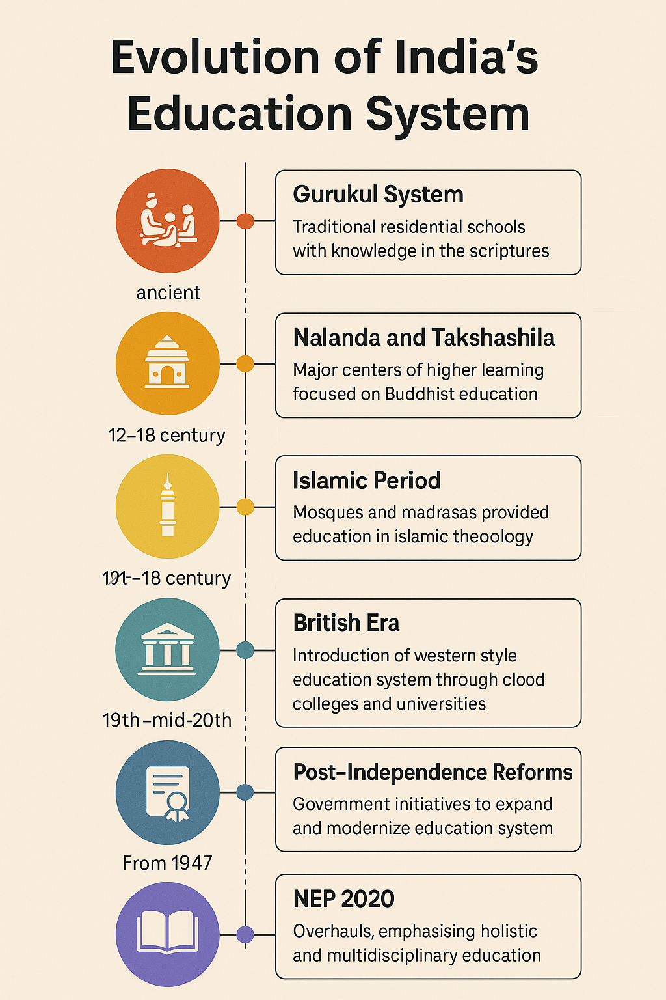

# From Gurukuls to Google Classrooms: Tracing India's Educational Journey

## From Trees to Screens: A Journey of Learning

***Time Period: Spanning from ancient times to the present day***

**Imagine this:** a calm morning in an ancient forest. Young boys sit cross-legged under a large banyan tree, listening to their guru. No books. No gadgets. Just spoken words, memorised prayers, and quiet discipline. In those Gurukuls, learning wasn’t just about lessons, but it was about shaping character, building focus, and connecting deeply with life.

Now, **fast forward to today:** A teenager rubs her eyes, wraps herself in a blanket, and logs into Google Classroom. Her teacher greets her from a tiny window on the screen. There are notifications pinging, a patchy Wi-Fi signal, and maybe a sibling making noise in the background. It is far from perfect but it’s still learning.

Education in India has always changed with the times. It reflects what the society values, whether it’s wisdom, discipline, job skills, or technology. But it also shows what we struggle with access, equality, and connection.

**So how did we go from sacred scripts under trees to screens and code in virtual rooms?** In this blog, let’s explore that journey, the evolution, resilience, and reform of Indian education. **Because understanding where we came from might just help us see where we are headed.**

## The Gurukul Way: Learning with Life

***Time Period: Vedic Era (~1500 BCE to 500 BCE)***

Long before classrooms had benches and boards, there were **Gurukuls**. Gurukuls were quiet places where learning happened under the open sky. A Gurukul was usually set in nature, far from cities and distractions.

Students lived with their teacher, or guru, and followed a life of discipline, simplicity, and learning. **It wasn’t just about reading or writing, it was about becoming a better human being.**

In these ancient Indian schools, everything was taught through memory and conversation. Students would listen to chants, repeat verses, and slowly build knowledge. *They learned spiritual ideas, stories from the Vedas and epics, life skills like farming or archery, and deep values like truth, respect, and patience.* **Education was seen as a lifelong journey, not just a way to get a job.**

But Gurukuls weren’t for everyone. Entry often depended on caste or family status. **Many groups, especially girls and lower castes, were left out of this system.** It’s one of the biggest truths we can’t ignore.

A famous example? **Sage Sandipani’s Gurukul, where Lord Krishna and Sudama studied together.** It shows how even divine stories are rooted in the same system of learning we once followed.

**This was India’s first classroom**, a world where the mind, body, and spirit were all part of education.

## From Forests to Halls: India’s First Universities

***Time Period: Classical Period (~500 BCE to 1200 CE)***

As time moved on, learning stepped out of the forest and into something bigger, **structured universities**. Places like **Nalanda and Takshashila** became centers of deep, organized knowledge. They weren’t just schools; they were full-fledged learning cities, with libraries, hostels, lecture halls, and thousands of students.

At **Nalanda University**, *students studied everything from logic and mathematics to medicine, astronomy, grammar, and Buddhist philosophy.* **It was one of the earliest known residential universities in the world.** *Monks, scholars, and seekers traveled from China, Korea, Tibet, and even further,* drawn by India’s wisdom and its peaceful way of learning. **The Chinese monk Xuanzang studied here and wrote about its grand halls and wise teachers.**

Similarly, **Takshashila, even older university**, *was known for practical subjects like politics, surgery, and economics. Learning here wasn’t about memorizing facts; it was about discussion, debate, and understanding how the world works.*

Sadly, this **golden age of learning didn’t last**. With the **invasions of the 12th century by Bakhtiyar Khilji, a Turkic invader**, many of these institutions were destroyed, libraries were burned, and knowledge scattered.

But the legacy remained. **These ancient universities showed the world that India once led not just in spirit, but also in science, ideas, and intellectual curiosity.**

## Shaping Scholars: Islamic Education and the Madrasa Era

***Time Period: Medieval Period (~1200 CE to 1700 CE)***

With the rise of the **Delhi Sultanate and later the Mughals,** India’s education system entered a new chapter. *The sacred chants and Sanskrit verses made space for Persian poetry, Arabic philosophy, and Islamic theology.* **Learning was still deeply respected then.**

The heart of education shifted to madrasas, Islamic schools that taught subjects like *logic, law, grammar, mathematics, astronomy, and religious studies.* These weren’t just **places of worship**, but they were **centers of scholarship and culture**. *Teachers and scholars debated philosophy, wrote beautiful poetry, and translated ancient texts into new languages.*

Under the Mughal rulers, especially **emperors like Akbar, education saw royal support.** Libraries were built. *Scholars were invited from across Central Asia and the Middle East.* **Persian became the language of the court and of learning.**

Yet, even as **formal madrasas grew**, many village communities continued their own styles of teaching that is through storytelling, local schools, and traditional knowledge passed from elders to children. **So, while the cities learned Persian prose, the villages still gathered under trees and taught through tales.**

It was a **period of blend of faith and logic, religion and reason, tradition and change.**

## The British Blueprint: The Birth of Modern Schools

***Time Period: Colonial Era (~1700 CE to 1947 CE)***

**The British Empire** brought sweeping changes to India, not just in politics and economics, but in education too. *The colonial government saw education as a tool for control—but it also laid the foundations for India’s modern schooling system.* This was when **the first formal schools, colleges, and universities began to take shape.**

Under British rule, **education shifted dramatically from the traditional, community-based systems to a more structured, Western-style model.** *English became the primary language of instruction, and subjects like science, mathematics, and history replaced many of the spiritual and cultural studies* that were central to earlier forms of education.

The British built institutions like **the University of Calcutta (1857), University of Bombay (1857), and University of Madras (1857), which followed the Western curriculum.** They were meant to produce a class of educated Indians who could help administer the colony—but they also helped sow the seeds of India’s modern intellectual movement.	However, this system wasn’t accessible to everyone. **It was mostly designed for the elite—leaving out large sections of the population, especially women and lower castes.** Education under the British was a double-edged sword: it helped modernize India’s intellectual life but also reinforced colonial power dynamics.

By the time India gained independence in 1947, *the country’s educational landscape had been dramatically reshaped leaving both a legacy of colonial education and a desire for reform.*

## New Beginnings: Shaping India’s Education System Post-Independence

***Time Period: Post-Independence (1947 CE to present)***

After gaining independence in 1947, India faced the monumental task of rebuilding and reshaping every aspect of society—including its education system. The vision was clear: **create an education system that would empower the masses, foster scientific temper, and reflect the diversity and values of a newly independent nation.**

One of the earliest steps was the establishment of institutions that would be the pillars of modern education in India. **The Indian Institutes of Technology (IITs), Indian Institutes of Management (IIMs), and Indian Institutes of Information Technology (IIITs)** were set up to provide *world-class education in engineering, management, and technology.* These institutions became the benchmark of excellence and *helped build India’s reputation on the global academic stage.*

At the same time, **the Right to Education Act (RTE)** was passed in 2009, ensuring that education became a **fundamental right for all children.** The government began to focus on **universalizing education, especially for girls, lower castes, and rural communities, the groups that had historically been excluded from formal learning.**
However, the road wasn’t easy. Despite progress, challenges like illiteracy, access to quality of education, and the urban-rural divide persisted.

Education in India *remained highly stratified*, with *urban areas benefiting more than rural ones,* and *private schools offering a level of education far superior to public ones.*

The **National Education Policy (NEP) 2020** marked a major shift in how education is approached in India. *It emphasized critical thinking, interdisciplinary learning, vocational training, and a flexible curriculum to cater to diverse student needs.* It aimed to bridge the gaps in access and quality, ensuring that education could contribute to India’s future as a global knowledge leader.

## The Digital Shift: From Blackboards to Broadband

***Time Period: 2000 CE to present***

In recent years, education in India has seen a massive shift, **from the traditional blackboards in classrooms to the broadband-powered learning** we now experience. With the **rise of private schools,** the growing culture of coaching classes, and the boom of EdTech, *learning is no longer confined to just textbooks and chalk.*

Then came COVID-19, which forced schools and colleges to *adapt quickly to online learning.* Suddenly, platforms like **Google Classroom, Zoom, and other digital tools became the new normal**. Students and teachers alike had to get used to **virtual classrooms**, and for many, this was a big adjustment.

At the same time, **platforms like BYJU'S, Unacademy, and many others** began offering *online learning in regional languages, making education more accessible across the country.* **Online learning** brought *great flexibility so students could learn from anywhere, at their own pace. It also made education more affordable for some.*

**But the digital shift isn’t without its challenges.** Too much screen time can lead to screen fatigue. And *while technology opened doors for some, it also created a digital divide, with rural areas and low-income students often unable to access the necessary tools and internet connection.* Still, the shift towards digital education has undoubtedly changed the landscape of learning in India.

## NEP 2020 and the Future of Education

**In 2020, India introduced the National Education Policy (NEP),** a bold step toward reshaping the education system. *The new policy focuses on holistic learning, meaning it’s not just about academic knowledge but also about building life skills, creativity, and emotional intelligence.* **The goal is to create well-rounded individuals, ready for the future.**

One of the key changes is a shift toward flexible learning. This means *students can choose subjects that interest them and follow a learning path that suits their strengths.* The NEP also emphasizes *multilingual education, encouraging students to learn in their mother tongue, but also to be proficient in other languages.*
Another exciting change is the *introduction of coding and vocational training from an early age*. This helps students *gain practical skills that are needed in today’s fast-changing world.* The policy also looks to *integrate technology more, making education tech-friendly and preparing students for a digital future.*

Lastly, the NEP aims to **bring together Indian knowledge systems with global education standards**, creating a unique and balanced approach to learning.

## Bridging Wisdom with Innovation

When we look at the journey of education in India, it’s amazing to see how it has come full circle. From the ancient wisdom shared under banyan trees in the gurukuls to the modern digital classrooms powered by technology, the essence of learning has always remained the same. At its heart, **education in India has always been about growth, understanding, and building character.**

Today, we are at a point where we must find a balance. On *one side, we have the deep cultural roots of India’s educational history, rich with values, traditions, and knowledge systems. On the other, we have the power of digital fluency,* **opening doors to a world of endless learning possibilities**. Both are important. We need to honor the past while embracing the future.

As we continue to shape the education system for the next generation, it’s worth asking: **What kind of classroom will our children inherit 50 years from now?** Will it be a space where technology and tradition coexist, where critical thinking and creativity are nurtured, and where every child, no matter where they come from, has the chance to learn and grow?

## Quote Box: Words of Wisdom

`"The highest education is that which does not merely give us information but makes our life in harmony with all existence."` — **Rabindranath Tagore**

## Call to Action (CTA)

**How has education changed your life?**

We’d love to hear your thoughts. Share how the evolution of education has shaped your personal learning journey, and what changes you hope to see in the future!

## Citation Key:
- [Britannica - Gurukul Education](https://www.britannica.com/topic/gurukul) 
- [NCERT Ancient Indian Education (general reference) UNESCO - Nalanda University](https://whc.unesco.org/en/list/1502/) 
- [Wikipedia - Nalanda](https://en.wikipedia.org/wiki/Nalanda)
- [Wikipedia - Takshashila](https://en.wikipedia.org/wiki/Takshashila)
- [Britannica - Madrasa](https://www.britannica.com/topic/madrasa)
- [Cambridge Journal - Madrasas in Indian History](https://www.cambridge.org/core/journals/modern-asian-studies/article/madrasas-in-indian-history/)
- [Darul Uloom Deoband History](https://www.darululoom-deoband.com/)
- [Vajiram & Ravi - British Education System in India](https://vajiramandravi.com/quest-upsc-notes/british-education-system-in-india/)
- [Wikipedia - University of Calcutta History](https://en.wikipedia.org/wiki/History_of_the_University_of_Calcutta)
- [Britannica - Wood's Dispatch](https://www.britannica.com/event/Woods-Dispatch )
- [Wikipedia - Indian Institutes of Technology](https://en.wikipedia.org/wiki/Indian_Institutes_of_Technology)
- [Government of India Ministry of Education (general reference) NEP 2020 Document](https://www.education.gov.in/sites/upload_files/mhrd/files/NEP_Final_English_0.pdf)
