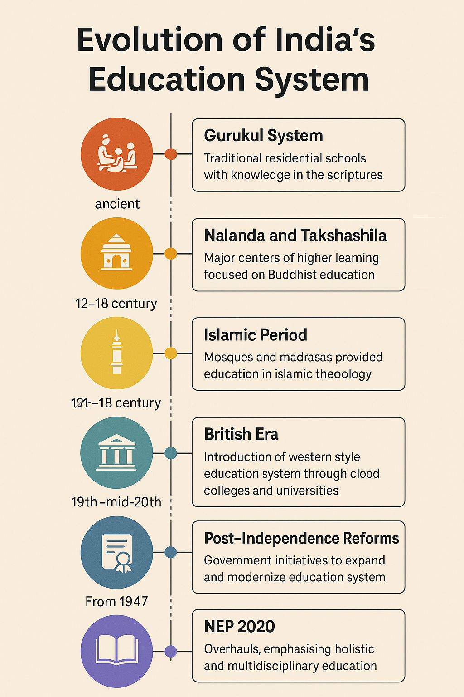

# From Gurukuls to Google Classrooms: Tracing India's Educational Journey

**From Trees to Screens:** *A visual journey through India's educational evolution from ancient wisdom to digital learning*

## Introduction

> **📅 Period**: ***spanning from ancient times to the present day***

**Imagine this:** a serene morning in an old forest. Under a big banyan tree, young boys listen to their guru while sitting cross-legged. Not a book. No electronics. Only verbal communication, recited prayers, and silent self-control. Learning in those Gurukuls involved more than just memorising facts; it also involved developing one's character, sharpening one's focus, and forging a close bond with reality.

Let's fast-forward to the present day: A teenager covers herself with a blanket, rubs her eyes, and opens Google Classroom. From a small window on the screen, her teacher welcomes her. The Wi-Fi signal is erratic, notifications are pinging, and there may be a sibling making background noise. It is still learning, but it is far from flawless.

India's schools have always changed with the times. It shows what people in society value, like wisdom, discipline, job skills, or technology. But it also shows how hard it is for us to access opportunities, be equal, and connect with others.

**So how did we go from sacred scripts under trees to screens and code in virtual rooms?** In this article, let's explore the journey, the evolution, resilience, and reform of Indian education. **Because understanding where we came from helps us see where we are headed.**

## The Roots: Pre-Vedic Learning Systems

> **📅 Period**: ***Indus Valley Civilization (~3300 BCE to 1300 BCE)***

Before Gurukuls, India's first civilisations had already developed advanced ways to share knowledge. Evidence suggests that a formal education system existed in the **ancient cities of Harappa and Mohenjo-daro** to teach people the practical skills they needed to live in a thriving town.

Through direct apprenticeship, kids and young adults learned the basics of **urban planning, hydraulic engineering, and metallurgy**. Knowledge was practical and focused on the needs of society at the time. The fact that weights, measures, and even building methods are so similar across Indus Valley sites suggests that people were trained and educated systematically.

This early education wasn't confined to technical skills. **The earliest forms of writing** (the still-undeciphered Indus script) point to a society that valued record-keeping and possibly had specialised scribes who passed their knowledge to the next generation.

These **systems of knowledge before the Vedic period** set the stage for the more organised ways of teaching that would come later.

## The Gurukul Way: Learning with Life

> **📅 Period**: ***Vedic Era (~1500 BCE to 500 BCE)***

Long before classrooms had benches and boards, there were **Gurukuls**. Gurukuls were quiet places where learning happened under the open sky. A Gurukul was usually set in nature, far from cities and distractions.

Students lived with their teacher, or guru, and followed a life of discipline, simplicity, and learning. **It wasn't just about reading or writing; it was about becoming a better human being.**

In these ancient Indian schools, everything was taught through memory and conversation. Students would listen to chants, repeat verses, and slowly build knowledge. *They learned spiritual ideas, stories from the Vedas and epics, life skills like farming or archery, and deep values like truth, respect, and patience.* **Education was seen as a lifelong journey, not just a way to get a job.**

However, Gurukul was not for everyone. Caste or family status frequently determined admission. **This system excluded many groups, notably lower castes and girls.** It's one of the most significant truths we cannot deny.

A famous example? **Sage Sandipani's Gurukul, where Lord Krishna and Sudama studied together.** It shows how even divine stories are rooted in the same system of learning we once followed.

**This was the first classroom** in India, where education encompassed the mind, body, and spirit.

## From Forests to Halls: India's First Universities

> **📅 Period**: ***Classical Period (~500 BCE to 1200 CE)***

As time moved on, learning stepped out of the forest and into something bigger, **structured universities**. Places like **Nalanda and Takshashila** became centres of deep, organised knowledge. They weren't just schools; they were full-fledged learning cities, with libraries, hostels, lecture halls, and thousands of students.

### 💡 Fun Facts:

- At **Nalanda University**, students studied everything from **logic** and **mathematics** to **medicine**, **astronomy**, **grammar**, and **Buddhist philosophy**.
- It was one of the **earliest known residential universities** in the world. 
- Monks, scholars, and seekers travelled from **China**, **Korea**, **Tibet**, and even further, drawn by India's wisdom and its peaceful way of learning. 
- The **Chinese monk Xuanzang** studied here and wrote about its grand halls and wise teachers.

Nalanda flourished for almost a thousand years under the support of the Gupta, Pushyabhuti, and Pala dynasties before Muhammad Bakhtiyar Khilji destroyed it in 1200 CE. Its role in bringing Sanskrit texts to East Asia and influencing Mahayana and Vajrayana Buddhism is indicative of its worldwide influence.

Similarly, **Takshashila**, an even older university, was known for practical subjects like **politics**, **surgery**, and **economics**. Learning here wasn't about memorising facts; it was about discussion, debate, and understanding how the world works.

### A Network of Ancient Learning Centres

India's ancient education system flourished beyond these two famous centres. **Vikramashila University**, founded in the 8th century by King Dharmapala of the Pala dynasty, became a renowned centre for Tantric Buddhism with more than 1,000 students and 100 teachers.

**Odantapuri**, established in the 8th century, was considered India's second-oldest university, housing around 12,000 students according to Tibetan records. **Valabhi University** in present-day Gujarat (600-1400 CE) specialised in Hinayana Buddhism and secular subjects, with Chinese traveller Yijing noting its education was comparable to Nalanda.

These five major mahaviharas: **Nalanda**, **Vikramashila**, **Odantapuri**, **Somapura**, and **Jagaddala** formed an interconnected network of higher learning. Scholars would often move between these institutions, creating a vibrant ecosystem of knowledge exchange.

### Buddhist and Jain Educational Traditions

While Buddhist institutions dominated the landscape, **Jain knowledge systems** also made significant contributions, particularly in **mathematics**, **astronomy**, and **philosophy**. Centres like **Shravanabelagola** became hubs for Jain learning, preserving ancient texts and developing new knowledge.

Sadly, this **golden age of learning didn't last**. With the **invasions of the 12th century by Bakhtiyar Khilji, a Turkic invader**, many of these institutions were destroyed, libraries were burned, and knowledge scattered.

But the legacy remained. These ancient universities showed the world that India once led not just in spirit, but also in science, ideas, and intellectual curiosity.

## Shaping Scholars: Islamic Education and the Madrasa Era

> **📅 Period**: ***Medieval Period (~1200 CE to 1700 CE)***

With the rise of the **Delhi Sultanate** and later **The Mughals**, India's education system entered a new chapter. *The sacred chants and Sanskrit verses made space for Persian poetry, Arabic philosophy, and Islamic theology*. **Learning was still deeply respected then.**

The heart of education shifted to **madrasas**, Islamic schools that taught subjects like **logic**, **law**, **grammar**, **mathematics**, **astronomy**, and **religious studies**. These weren't just **places of worship**, but they were **centres of scholarship and culture**. *Teachers and scholars debated philosophy, wrote beautiful poetry, and translated ancient texts into new languages.*

Under the Mughal rulers, especially emperors like **Akbar**, education saw royal support. Libraries were built. Scholars were invited from across Central Asia and the Middle East. **Persian became the language of the court and of learning.**

Yet, even as **formal madrasas grew**, many village communities continued their own styles of teaching, that is, through storytelling, local schools, and traditional knowledge passed from elders to children. **So, while the cities learned Persian prose, the villages still gathered under trees and taught through tales.**

It was a **period of blend of faith and logic, religion and reason, tradition and change.**

## The British Blueprint: The Birth of Modern Schools

> **📅 Period**: ***Colonial Era (~1700 CE to 1947 CE)***

**The British Empire** brought sweeping changes to India, not just in politics and economics, but in education too. *The colonial government saw education as a tool for control—but it also laid the foundations for India's modern schooling system.* This was when **the first formal schools, colleges, and universities began to take shape.**

### 💡 Key Colonial Educational Reforms

- **Macaulay's Minute (1835)**: Promoted English as the medium of instruction and aimed to create a class of Indians "English in taste, in opinions, in morals, and in intellect"
- **Wood's Dispatch (1854)**: Often called "Magna Carta of English Education in India," established departments of public instruction and proposed a network of graded schools
- **Hunter Commission (1882)**: Focused on primary and secondary education, advocating for increased private initiatives and local control

Under British rule, **education shifted dramatically from the traditional, community-based systems to a more structured, Western-style model.** *English became the primary language of instruction, and subjects like science, mathematics, and history replaced many of the spiritual and cultural studies* that were central to earlier forms of education.

### 💡 Key Institutions Established:

- **University of Calcutta (1857)**
- **University of Bombay (1857)**
- **University of Madras (1857)**

These institutions followed the Western curriculum and were meant to produce a class of educated Indians who could help administer the colony—but they also helped sow the seeds of India's modern intellectual movement. 

### The Lasting Legacy: Colonial Blueprint in Modern Education

The British education system wasn't just about introducing new subjects or the English language; it was **deliberately designed to restrict free thinking and serve colonial interests**. Its primary objective was to produce obedient clerks and administrators who would serve colonial interests without questioning authority.

> "The British had established their colony in India through the changed education system. When they couldn't enslave India, they decided to do it through psychological slavery."

This approach, often described as "**Macaulayism**", ingrained order, discipline, and deference to authority, while **systematically dismantling** indigenous knowledge systems and the traditional gurukul model that encouraged holistic learning and critical thought. In their place arose a system that prioritised rote learning, rigid examinations, and a structure that rewarded memorisation, compliance, and unquestioning acceptance of Western knowledge - traits antithetical to innovation and research.

Years after independence, this blueprint still persists. Even today's Indian education system continues to follow the colonial lines, and **excel at producing "corporate-ready" graduates**, skilled at following instructions but often hesitant to challenge established norms. The result is evident: despite India's massive youth population, the country lags significantly in research output and innovation metrics, with relatively few world-class research institutions compared to nations that prioritised intellectual autonomy in their educational models.

### Indigenous Response and Educational Reform

While many embraced British education, others worked to reform it or create alternatives. **Raja Ram Mohan Roy** advocated for Western scientific education while preserving Indian cultural values. **Ishwar Chandra Vidyasagar** reformed Bengali education and worked for women's education. **Jyotirao Phule** fought for access to education for lower castes and women.

**Public libraries** emerged as alternative knowledge centres, providing education outside formal institutions. These indigenous responses to colonial education helped shape a unique blend of Western and Indian educational approaches.

However, this system wasn't accessible to everyone. **It was primarily designed for the elite, leaving out large sections of the population, especially women and lower castes.** Education under the British was a double-edged sword: it helped modernise India's intellectual life but also reinforced colonial power dynamics.

By the time India gained independence in 1947, *the country's educational landscape had been dramatically reshaped, leaving both a legacy of colonial education and a desire for reform.*

## Scientific Temples: India's Research Renaissance

> **📅 Period**: ***Pre-Independence (1900s to 1947) to Post-Independence***

While the colonial education system focused on creating administrators, a parallel movement to establish **indigenous scientific institutions** began in the early 20th century, laying the foundation for India's research ecosystem.

### Pre-Independence Research Foundations

The **Indian Institute of Science (IISc)** was established in 1909 in Bangalore, founded by **Jamshetji Tata** with support from the Mysore State. It became the cradle for India's scientific leadership, where luminaries like **Homi Bhabha** studied and **C.V. Raman** served as the first Indian Director. During World War II, IISc pioneered aeronautical engineering education, laying the groundwork for India's future technological self-reliance.

Just before independence, **Homi J. Bhabha** established the **Tata Institute of Fundamental Research (TIFR)** in 1945, India's first dedicated nuclear research centre. This institution would later become pivotal in shaping India's atomic energy program.

Other crucial pre-independence research institutions that formed India's scientific backbone include:

- **Indian Agricultural Research Institute (IARI)** established in 1905 as the Imperial Agricultural Research Institute in Pusa (Bihar), which later became the cornerstone of India's Green Revolution
- **Indian Council of Medical Research (ICMR)**, founded in 1911 as the Indian Research Fund Association, would later play a vital role in India's health research
- **Indian Statistical Institute (ISI)** established in 1931 by P.C. Mahalanobis to apply statistics to economic planning, which designed India's Second Five-Year Plan model
- **Council of Scientific & Industrial Research (CSIR)** was founded in 1942 during WWII to solve industrial challenges, and later established a network of national laboratories across India

### Post-Independence Scientific Evolution

After independence, these scientific institutions expanded rapidly under visionary leadership:

- The **Atomic Energy Establishment** (later renamed **Bhabha Atomic Research Centre**) emerged from TIFR in 1948, with Bhabha's "Three-Stage Nuclear Program" making India self-reliant in atomic energy.

- **Vikram Sarabhai**, mentored by Bhabha, established **INCOSPAR** (Indian National Committee for Space Research) in 1962, which launched India's space program with the Thumba rocket station in 1963. This later transformed into **ISRO** in 1969, with **Abdul Kalam** on the founding team.

- The **Defence Research and Development Organisation (DRDO)** was formed in 1958, creating Asia's largest defence R&D network. Under **Abdul Kalam's** leadership in the 1970s, Projects Devil and Valiant led to the development of Prithvi and Agni missiles.

These institutions created a unique model of "Science for Society," focusing on applying advanced research to solve India's practical challenges.

## New Beginnings: Shaping India's Education System Post-Independence

> **📅 Period**: ***Post-Independence (1947 CE to present)***

After gaining independence in 1947, India faced the monumental task of rebuilding and reshaping every aspect of society—including its education system. The vision was clear: **create an education system that would empower the masses, foster scientific temper, and reflect the diversity and values of a newly independent nation.**

### 💡 Education Commissions and Regulatory Bodies

- **Radhakrishnan Commission (1948-49)**: Focused on university education and suggested reforms to improve higher education quality
- **University Grants Commission (UGC) (1956)**: Standardised university education and funded institutions across the country
- **All India Council for Technical Education (AICTE) (1945/1987)**: Regulates technical institutions and introduced accreditation systems
- **National Council for Educational Research and Training (NCERT) (1961)**: Unified state curricula and published textbooks used by millions of students
- **Kothari Commission (1964-66)**: Proposed the "10+2+3" education structure still used today and emphasized science education
- **National Policy on Education 1968**: India's first education policy, it addressed equal educational opportunities, especially for women and rural areas
- **National Policy on Education 1986 (revised 1992)**: Emphasised removing disparities and modernising educational practices before NEP 2020

### Adult Literacy Initiatives

To address India's literacy challenges, the government launched the **National Adult Education Program (1978)** and later the **National Literacy Mission (1988)**, aiming to make 80 million adults literate, mainly focusing on women's literacy.

### Medical Education Revolution

The establishment of the **All India Institute of Medical Sciences (AIIMS) Delhi in 1956** transformed medical education in India, introducing merit-based admission and integrating research with medical training. This model would later be replicated across the country with multiple AIIMS institutions.

### 💡 Major Developments:

- Establishment of **Indian Institutes of Technology (IITs)**
- Creation of **Indian Institutes of Management (IIMs)**
- Launch of **Indian Institutes of Information Technology (IIITs)**

The concept of premier institutes for studying management and technology was introduced in 1961, beginning with **IIM Ahmedabad**, co-founded by Vikram Sarabhai and Kasturbhai Lalbhai, blending Indian ethos with Harvard pedagogy.

These institutions like **IISc**, **IISER**, **TIFR**, **IITs**, **NITs**, **IIITs**, **IIMs**, **AIIMS**, and many more were slowly set up, which provided *world-class education in engineering, management, technology, medicine, and many more.* They became the benchmark of excellence and *helped build India's reputation on the global academic stage.*

### Literacy Movements and Universal Access

To address India's literacy challenges, the government launched major initiatives:

- **National Literacy Mission (1988)**: Aimed to make 80 million adults literate, raising India's literacy rate from 52% (1991) to 77% (2023)
- **Sarva Shiksha Abhiyan (2001)**: Achieved 98% rural primary school access by 2018
- **Right to Education Act (2009)**: Ensured education became a fundamental right for all children, introducing 25% reservation in private schools for disadvantaged groups

### Technological Self-Reliance

The **Integrated Guided Missile Program** launched in 1983 under Abdul Kalam's direction developed the Agni, Prithvi, and Akash missiles, making India a member of the exclusive missile technology club. 

Early digital education foundations were laid by TIFR's computer science work in the 1960s, followed by **ERNET** (Education and Research Network) in 1986, India's first internet network connecting academic institutions.

At the same time, **the Right to Education Act (RTE)** was passed in 2009, ensuring that education became a **fundamental right for all children.** The government began to focus on **universalising education, especially for girls, lower castes, and rural communities. These groups had historically been excluded from formal learning.**

However, the road wasn't easy. Despite progress, challenges like illiteracy, access to quality education, and the urban-rural divide persisted.

Education in India *remained highly stratified*, with *urban areas benefiting more than rural ones,* and *private schools offering a level of education far superior to public ones.*

The **National Education Policy (NEP) 2020** marked a significant shift in how education is approached in India. *It emphasised critical thinking, interdisciplinary learning, vocational training, and a flexible curriculum to cater to diverse student needs.* It aimed to bridge the gaps in access and quality, ensuring that education could contribute to India's future as a global knowledge leader.

## The Digital Shift: From Blackboards to Broadband

> **📅 Period**: ***2000 CE to present***

In recent years, education in India has seen a massive shift, **from the traditional blackboards in classrooms to the broadband-powered learning** we now experience. With the **rise of private schools,** the growing culture of coaching classes, and the boom of EdTech, *learning is no longer confined to just textbooks and chalk.*

### India's Digital Education Ecosystem

Before the pandemic accelerated digitisation, India had already begun building its digital education infrastructure:

- **NPTEL (2003)**: IITs and IISc created this pioneering platform offering thousands of engineering and science courses
- **SWAYAM (2017)**: Government MOOC platform offering courses with credit transfer systems across disciplines
- **DIKSHA (2017)**: National Teacher Platform supporting learning in multiple Indian languages
- **National Testing Agency (2017)**: Standardised testing for millions of students applying to higher education

### The Pandemic Impact:

COVID-19 forced schools and colleges to *adapt quickly to online learning.* Suddenly, platforms like **Microsoft Teams**, **Google Meet**, **Zoom**, and other video conferencing tools became the new normal and teachers started conducting classes over video calls. Apps like **Google Classroom**, **Telegram** and **WhatsApp** became tools for sharing notes, assignments, and resources. Students and teachers alike had to get used to **virtual classrooms**, and for many, this was a big adjustment.

#### 💡 Institutional Adaptations:

- **Universities rapidly transformed**: Traditional institutions shifted entire curricula online, developing new assessment methods and learning approaches
- **Digital infrastructure investment**: Educational institutions invested in digital platforms, training faculty for online instruction
- **Blended learning models**: Many institutions developed hybrid approaches combining online and offline learning

#### 💡 Impact Across Demographics:

- **Urban students**: Generally adapted better with greater access to devices and stable internet
- **Rural students**: Often faced significant challenges with connectivity and device availability
- **Economically disadvantaged**: The pandemic widened educational inequalities, with many unable to continue education online
- **Students with disabilities**: Experienced both new opportunities and challenges with digital learning formats

### EdTech Revolution:

Platforms like **BYJU'S**, **Unacademy**, and many others began offering *online learning in regional languages, making education more accessible across the country.* **Online learning** brought great flexibility so students could learn from anywhere, at their own pace. It also made education more affordable for some.

### Challenges of Digital Education:

**But the digital shift isn't without its challenges.** Too much screen time leads to screen fatigue. And *while technology opened doors for some, it also created a digital divide, with rural areas and low-income students often unable to access the necessary tools and internet connection.* Still, the shift towards digital education has undoubtedly changed the landscape of learning in India.

## NEP 2020 and the Future of Education

**In 2020, India introduced the National Education Policy (NEP),** a bold step toward reshaping the education system. *The new policy focuses on holistic learning, meaning it's not just about academic knowledge but also about building life skills, creativity, and emotional intelligence.* **The goal is to create well-rounded individuals, ready for the future.**

### 💡 Key Features of NEP 2020:

- **Flexible Learning:** *Students can choose subjects that interest them and follow a learning path that suits their strengths.*
- **Multilingual Education:** *Encouraging students to learn in their mother tongue, but also to be proficient in other languages.*
- **Early Skill Development:** *Introduction of coding and vocational training from an early age* to help students *gain practical skills needed in today's fast-changing world.*
- **Technology Integration:** *Making education tech-friendly and preparing students for a digital future.*
- **Balanced Approach:** Bringing together **Indian knowledge systems with global education standards**, creating a unique and balanced approach to learning.

## Bridging Wisdom with Innovation: Conclusion

When we look at the journey of education in India, it's amazing to see how it has come full circle. From the ancient wisdom shared under banyan trees in the gurukuls to the modern digital classrooms powered by technology, the essence of learning has always remained the same. At its heart, **education in India has always been about growth, understanding, and building character.**

Today, we are at a point where we must find a balance. On *one side, we have the deep cultural roots of India's educational history, rich with values, traditions, and knowledge systems. On the other hand, we have the power of digital fluency,* **opening doors to a world of endless learning possibilities**. Both are important. We need to honour the past while embracing the future.

As we continue to shape the education system for the next generation, it's worth asking: **What kind of classroom will our children inherit 50 years from now?** Will it be a space where technology and tradition coexist, where critical thinking and creativity are nurtured, and where every child, no matter where they come from, has the chance to learn and grow?

> ### Words of Wisdom
>
> *"The highest education is that which does not merely give us information but makes our life in harmony with all existence."* — **Rabindranath Tagore**
>

---

### Share Your Story

**How has education changed your life?**

We'd love to hear your thoughts. Share how the evolution of education has shaped your personal learning journey, and what changes you hope to see in the future!

---

### References

- [Britannica - Gurukul Education](https://www.britannica.com/topic/gurukul) 
- [NCERT Ancient Indian Education (general reference) UNESCO - Nalanda University](https://whc.unesco.org/en/list/1502/) 
- [Wikipedia - Nalanda](https://en.wikipedia.org/wiki/Nalanda)
- [Wikipedia - Takshashila](https://en.wikipedia.org/wiki/Takshashila)
- [Britannica - Madrasa](https://www.britannica.com/topic/madrasa)
- [Cambridge Journal - Madrasas in Indian History](https://www.cambridge.org/core/journals/modern-asian-studies/article/madrasas-in-indian-history/)
- [Darul Uloom Deoband History](https://www.darululoom-deoband.com/)
- [Vajiram & Ravi - British Education System in India](https://vajiramandravi.com/quest-upsc-notes/british-education-system-in-india/)
- [Wikipedia - University of Calcutta History](https://en.wikipedia.org/wiki/History_of_the_University_of_Calcutta)
- [Britannica - Wood's Dispatch](https://www.britannica.com/event/Woods-Dispatch)
- [Wikipedia - Indian Institutes of Technology](https://en.wikipedia.org/wiki/Indian_Institutes_of_Technology)
- [Government of India Ministry of Education (general reference) NEP 2020 Document](https://www.education.gov.in/sites/upload_files/mhrd/files/NEP_Final_English_0.pdf)
